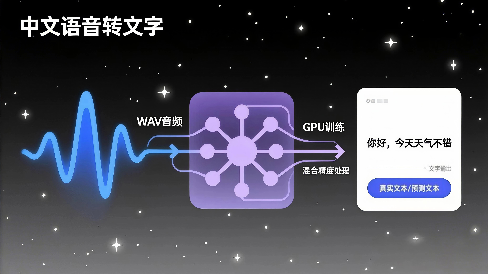
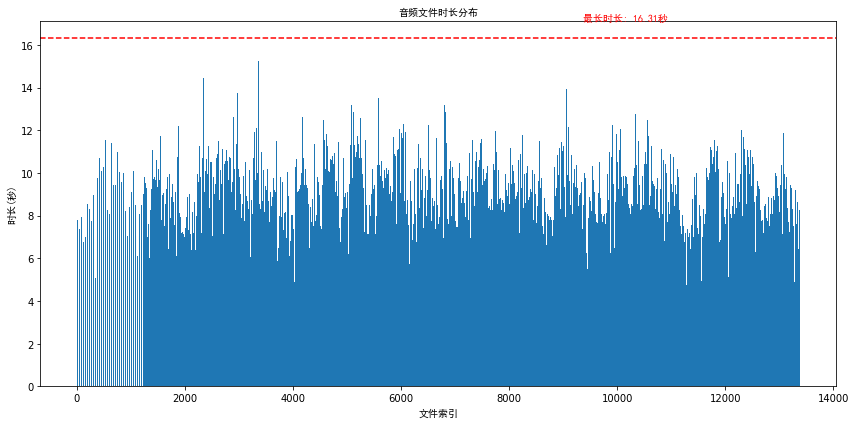
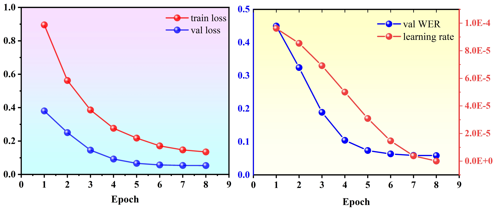
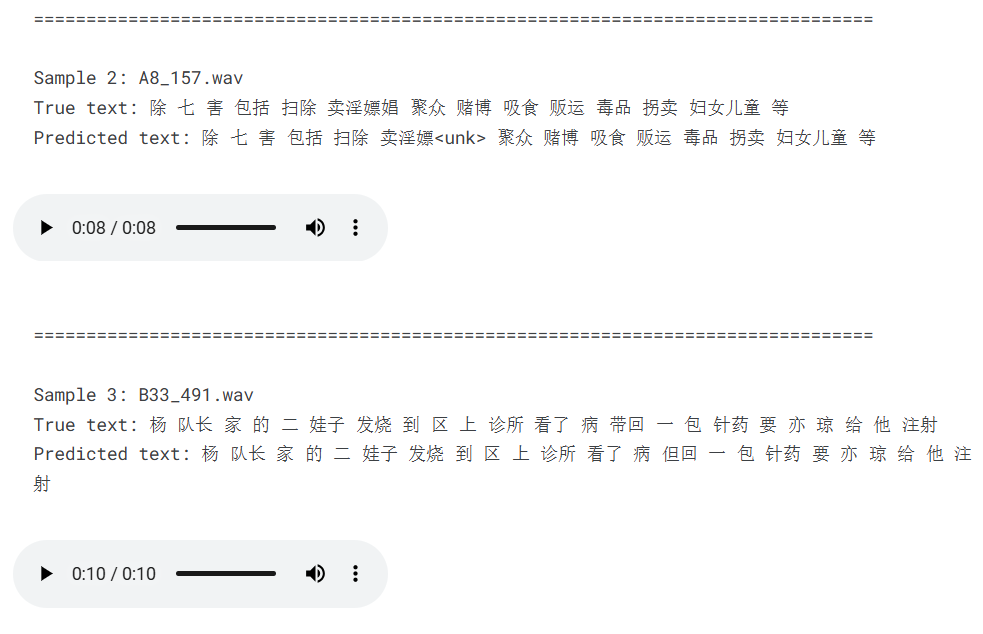

# **中文语音识别系统：基于 Wav2Vec2 的语音转文本实现**



[](https://opendatalab.org.cn/OpenDataLab/THCHS-30)[](https://huggingface.co/docs/transformers/main/en/model_doc/wav2vec2)[](https://www.mit.edu/)

---

## 📋目录

- 🌟[项目介绍](#项目介绍)
- 📊[数据集说明](#数据集说明)
- 📁[文件夹结构](#文件夹结构)
- 🧠[模型架构实现](#模型架构实现)
- 🚀[快速开始](#快速开始)
- 📈[结果展示](#结果展示)

---

## 项目介绍

本项目是一个基于深度学习的中文语音识别系统，旨在将中文语音信号准确转换为对应的文本内容。该系统利用 Hugging Face 的 Transformers 库中预训练的 Wav2Vec2 模型进行微调，专门针对中文语音识别任务进行优化。

Wav2Vec2 是 Facebook AI 研究院提出的一种先进的自监督学习语音模型，能够从大量未标注的语音数据中学习语音表示。本项目基于预训练的 "wav2vec2-large-xlsr-53-chinese-zh-cn" 模型进行微调，该模型已经在大量中文语音数据上进行了预训练，非常适合中文语音识别任务。

系统采用了 CTC（Connectionist Temporal Classification）损失函数，这是一种常用于序列到序列学习的损失函数，特别适合语音识别这类输入和输出序列长度不一致的任务。

项目实现了完整的语音识别流程，包括：

- 音频数据预处理（格式转换、重采样、声道处理）
- 自定义数据集加载和处理
- 模型训练与微调
- 模型评估（使用 WER 指标）
- 结果可视化与分析

此外，系统还集成了多种优化技术以提高性能和训练效率：

- 混合精度训练（支持 CUDA 加速）
- 学习率调度（Cosine Annealing 策略）
- 早停机制（防止过拟合）
- 数据批处理与填充策略

该系统可应用于语音助手、语音输入、语音转写等多种场景，为中文语音交互提供技术支持。


## 数据集说明

本项目使用 THCHS-30 中文语音数据集进行模型训练和评估。THCHS-30 是一个常用的中文语音识别数据集，包含 30 小时的语音数据。

数据集的组织结构如下：

- 音频文件：以 WAV 格式存储，采样率可能有所不同
- 标签文件：与音频文件同名的.trn 文件，包含对应的中文文本标签

数据集的音频时长与索引分布如下所示：



在代码中，数据集路径默认为`/kaggle/input/chinese-speech-to-textthchs30/data/data`，用户可根据实际情况修改。

数据预处理步骤包括：

1. 读取 WAV 音频文件和对应的.trn 标签文件
2. 将双声道音频转换为单声道
3. 将音频重采样至 16kHz（Wav2Vec2 模型的输入要求）
4. 使用 Wav2Vec2Processor 对音频和文本进行处理，生成模型输入格式

数据集被划分为训练集和验证集，比例为 8:2，使用随机划分方式，并设置了固定的随机种子以保证实验的可重复性。


## 文件夹结构

```makefile
Chinese_Speech_Recognition\
├── README.md
├── data.ipynb                  # 用于数据分析和预处理
├── data\
    ├── data_thchs30\           # THCHS-30中文语音数据集
        ├── README-data.md      # 数据集说明文档
        └── data\               # 实际音频数据存放目录
├── log\
├── output\                     # 输出结果目录
    ├── model\                  # 模型存储目录
        ├── sound.pth           # 训练好的模型权重文件
        └── wav2vec2-large-xlsr-53-chinese-zh-cn\  # 预训练模型目录
    ├── pic\                    # 图片和可视化结果目录
    ├── test_results.xlsx       # 测试结果数据表
    └── training_history.xlsx   # 训练历史记录数据表
├── requirements.txt 
└── train.py
```


## 模型架构实现

本项目基于 Wav2Vec2 模型架构实现，具体使用了 "jonatasgrosman/wav2vec2-large-xlsr-53-chinese-zh-cn" 预训练模型进行微调。

模型架构主要包括以下部分：

1. **特征提取器**：将原始音频波形转换为声学特征
2. **Transformer 编码器**：由多个 Transformer 层组成，用于捕获音频序列中的上下文信息
3. **CTC 头**：将 Transformer 的输出映射到字符表，用于计算 CTC 损失和生成预测

在代码中，模型的初始化参数进行了针对性设置：

```python
model = Wav2Vec2ForCTC.from_pretrained(
    "jonatasgrosman/wav2vec2-large-xlsr-53-chinese-zh-cn",
    attention_dropout=0.1,
    hidden_dropout=0.1,
    feat_proj_dropout=0.0,
    mask_time_prob=0.05,
    layerdrop=0.1,
    ctc_loss_reduction="mean",
    pad_token_id=processor.tokenizer.pad_token_id,
    vocab_size=len(processor.tokenizer)
)
```

这些参数设置有助于防止过拟合，并提高模型在中文语音识别任务上的性能。

训练过程中使用了 AdamW 优化器和 Cosine Annealing 学习率调度器，以实现更有效的模型优化。


## 快速开始

### 安装依赖

```bash
pip install -r requirements.txt
```

### 数据准备

1. 下载 THCHS-30 数据集

2. 修改代码中的`data_dir`变量，指向你的数据集路径：

   ```python
   data_dir = "/path/to/your/dataset"  # 修改为你的数据路径
   ```


### 运行训练

直接运行脚本即可开始训练过程：

```bash
python train.py
```

训练过程中，系统会自动：

1. 加载并预处理数据
2. 划分训练集和验证集
3. 初始化模型和优化器
4. 进行模型训练和验证
5. 根据早停机制保存最佳模型

### 训练参数调整

你可以根据需要调整以下关键参数：

- `num_epochs`：训练轮数，默认为 8
- `batch_size`：批处理大小，训练集默认为 4，验证集默认为 2
- `lr`：初始学习率，默认为 1e-4
- `early_stopping_patience`：早停耐心值，默认为 3


## 结果展示

训练过程中，系统会实时输出训练损失和验证指标，并将结果保存到以下文件：

1. **最佳模型权重**：`/kaggle/working/best_model.pth`
2. **训练历史记录**：`/kaggle/working/training_history.xlsx`，包含每轮的：
   - 训练损失
   - 验证损失
   - 验证集 WER（字错误率）
   - 学习率
3. **测试结果**：`/kaggle/working/test_results.xlsx`，包含随机选择的 10 个验证样本的：
   - 音频文件名
   - 真实文本
   - 预测文本

WER（Word Error Rate，字错误率）是语音识别任务的主要评估指标，计算公式为：

```plaintext
WER = (替换错误 + 插入错误 + 删除错误) / 参考文本字数
```

WER 值越低，表示识别效果越好，0 表示完全正确。

训练的历史记录如下：



训练结束后，系统会输出最终模型在验证集上的表现：

```plaintext
最终模型在验证集上的表现:
最终验证Loss: 0.0532
最终验证WER: 0.0584 (错误率：5.84%)
```

同时，系统会展示 10 个随机样本的识别结果，包括真实文本和预测文本，并尝试显示音频播放器以便直观对比。（下面为图片，音频是假的）



这个才是真的，因为这个是视频：

<video src="./output/pic/sound.mp4"></video>

💡 GitHub可能无法正常显示缩略图，请查看demo.mp4